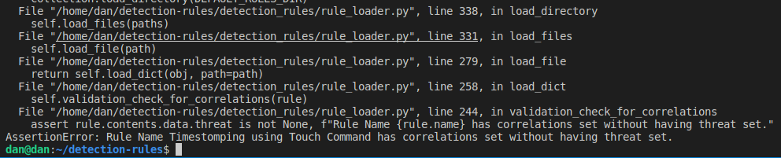
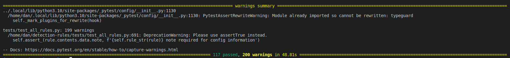

# Task 1 - Dan Muller
Add schema and validation support in detection-rules for a new field within the Rule
object with the following requirements  

    a. Name: correlations
    b. Value type: an optional array of UUIDs
    c. Applies to all rule types
    d. Is only valid if a threat object is set within a rule (for validation

# Solution 

For this task, the first thing I did was open up ***rule.py*** to try and figure out how all the different rule types were created. What I saw was BaseRuleData is the base class that is extended to all the rule types below : 

```
AnyRuleData = Union[EQLRuleData, ThresholdQueryRuleData, ThreatMatchRuleData, MachineLearningRuleData, QueryRuleData]
```

Since the new correlations field had to be added to every rule type, I added the field to the BaseRuleData since that will be used by every rule type. I set the field to be optional ,and made it a list of UUIDStrings. I used UUIDString instead of string, so that there will be a UUID validation check for that field when a rule is created.   

```
correlations : Optional[List[definitions.UUIDString]]
```

To add validation support I looked through the ***main.py*** and looked through how a file was validated. I saw to validate a rule the RuleCollection().load_file() function is called. I decided to put the validation check right after the contents of the TOML file is read in and before the rule is added in self.add_rule. I only added the validation check for production files since deprecated files won't have the new added field ,and do not want to mark them as invalid for backwards compatibility.

```
def validation_check_for_correlations(self, rule: TOMLRule):
    if rule.contents.data.correlations is not None:
        assert rule.contents.data.threat is not None, f"Rule Name {rule.name} has correlations set without having threat set."

def load_dict(self, obj: dict, path: Optional[Path] = None) -> Union[TOMLRule, DeprecatedRule]:
    # bypass rule object load (load_dict) and load as a dict only
    if obj.get('metadata', {}).get('maturity', '') == 'deprecated':
        contents = DeprecatedRuleContents.from_dict(obj)
        contents.set_version_lock(self._version_lock)
        deprecated_rule = DeprecatedRule(path, contents)
        self.add_deprecated_rule(deprecated_rule)
        return deprecated_rule
    else:
        contents = TOMLRuleContents.from_dict(obj)
        contents.set_version_lock(self._version_lock)
        rule = TOMLRule(path=path, contents=contents)
        self.validation_check_for_correlations(rule)
        self.add_rule(rule)
        return rule
```

To verify my code works I ran the command below and all the rules passed: 

```
python -m detection_rules validate-all
```

To test the code further I modified existing rule files with different combinations of having/not having correlations and threat fields, and ran the validate-all command. In the test case below I took out the threat data and put in correlations data causing the validation check to fail:



Since this is a new feature I wanted to add a unit test that would ensure, the new format is followed in future rules. I looked through ***test_all_rules.py*** in the test folder. This test is made up of multiple tests that iterate through all the rules checking the metadata, syntax, format e.g. I made a new unit test in the class "TestCorrelationsValidity" and test asserts correlations to only be valid when a threat object is set. 

```
class TestCorrelationsValidity(BaseRuleTest):
    """Test that there are no rules where correlations is added without having the threat object set"""

    def test_correlations_only_set_when_threat_set(self):
        invalid_list = []
        for rule in self.all_rules:
            threat = rule.contents.data.threat or []
            correlations = rule.contents.data.correlations or []
            if correlations and not threat:
                invalid_list.append(f'{self.rule_str(rule)}')

        if invalid_list:    
            invalid_str = '\n'.join(invalid_list)
            err_msg = 'The following rules have the correlations field without having the threat field set:\n'
            err_msg += invalid_str
            self.fail(err_msg)
```

To run the tests I ran the command below:

```
python -m detection_rules test
```

The picture below shows all tests passing: 


