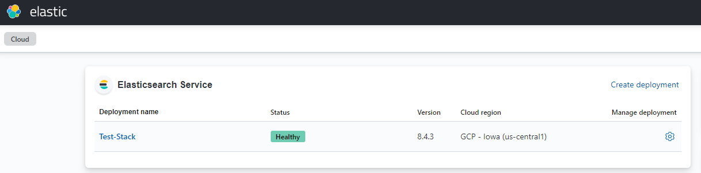
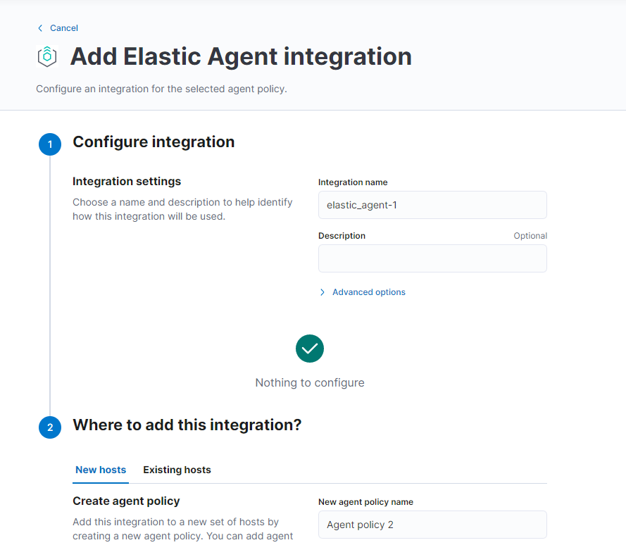
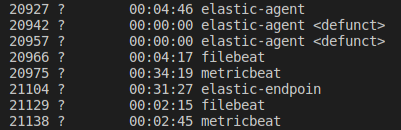
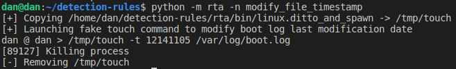
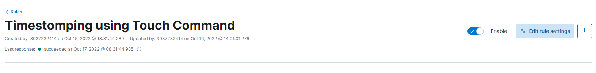
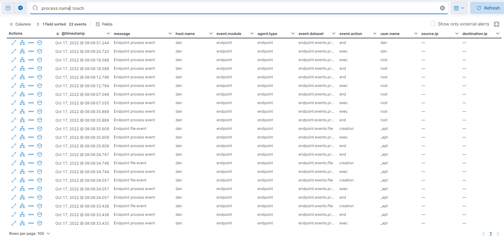
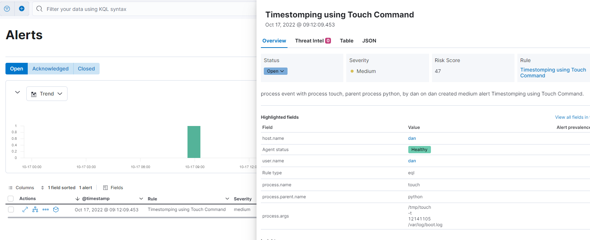

# Task 3 - Dan Muller

Build a stack from a trial cloud deployment and pick any detection rule which does not have an existing RTA and create an RTA for it  

    a. Build any stack version from cloud
    b. Setup an endpoint agent on a host (VM, etc.)
    c. Execute the RTA and collect generated events
    d. Show proof of a triggered rule


# Solution

First Step was going to https://cloud.elastic.co and making a new account to get a free cloud deployment trial. Once I got the trial, I clicked on "Create Deployment", and stepped through the process to make a new stack.



Next I spawned up a fresh Ubuntu 22 VM on my local machine where I would deploy my elastic endpoint agent. I clicked on the integration tab, and stepped through the "Add Elastic Agent" page.



I was prompted to install the agent on my machine ,and was given a list of install commands to run on my VM. After that I successfully had the agent installed , and was able to monitor the VM. 



Now since the agent was installed, I went to the next part of the task which was creating a RTA for a detection rule. I looked through the RTAs already created ,and tried reverse engineering the process for how they were derived from rules. I opened up a number of RTAs and compared them to the rules they were based off of.  

I saw that each rule had a query that had to be met based off of information in  args, process, user, e.g. ,and that the RTA was making sure that all the requirements for the query were met.

One RTA I was looking at was the ***grep_software_discovery.py***. I saw that it was essentially masquerading the grep command for both linux and MacOS, but still it was able to set off the query for the detection rule. I looked for a rule similiar to the grep RTA and found the ***defense_evasion_timestomp_touch.toml***. This detection rule is able to be triggered off running a linux cmd like ***grep_software_discovery.py***.

Below is the code from a RTA I made ***modify_file_timestamp.py*** to masquerade the touch command for linx and MacOS.
```
masquerade = "/tmp/touch"
if common.CURRENT_OS == "linux":
    source = common.get_path("bin", "linux.ditto_and_spawn")
    common.copy_file(source, masquerade)
else:
    common.create_macos_masquerade(masquerade)

## Execute command
common.log("Launching fake touch command to modify boot log last modification date")
common.execute([masquerade,"-t","12141105","/var/log/boot.log"],timeout=10,kill=True)

# cleanup
common.remove_file(masquerade)
```

I saw that other RTAs did acually call the actual command itself, but thought it might be better in this case to not call the command so that no modications to any files are actually made. If I would have called the actual command I would have just made a temporary file, changed the timestamp on that, and then remove that file as part of the cleanup. Would then have to check that the file creation part does not set off any other detection rules though if I just wanted this RTA to set off only the timestomp rule. 

To execute the RTA I ran:
```
python -m rta -n modify_file_timestamp
```
Below is the output from that execution



To make sure that we would trigger on that rule I had to enable the Timestomping rule since it was not enabled by default:



After running the RTA we can see the list of generated event shown below. I filtered the generated event on "process.name : touch" to only show the events associated with that command.



As shown in the picture below, can see that the events triggered the "Timestomping using Touch Command" detection rule 



As far as maintaining this RTA in the repo, since the RTA is assoicated with the given rule in the metadata, any changes to that rule may apply to the RTA.